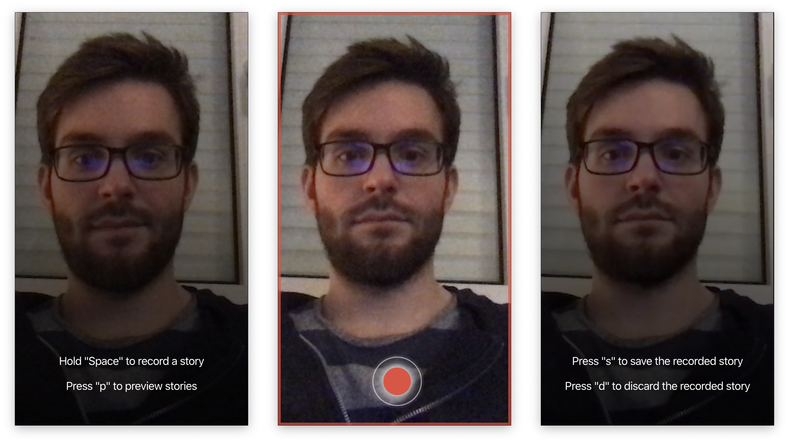

# Workstories

[Download from releases](https://github.com/timoweiss/workstories/releases)

Electron app to record short video sequences to later recall what you have done that day.
I built this with the idea to have something to effordless collect notes throughout the day.
The app might not be best suited for open plan offices - at least if you don't want to bother your coworkers all the time ;)

## Usage

The application is mostly controlled using keyboard keys.

- toggle app: `CMD+Shift+U`
- record video: `Space`
  - save recorded video: `s`
  - discard recorded video: `d`
- navigate to video list: `p`
- navigate to recording view: `r`

## Privacy

No data is leaving your computer!
All video-files are stored in the following directory `/Users/<your_username>/Movies/workstories`.
There is a file which is used to collect the meta-data of the recorded videos which is located at the applications directory `/Users/<your_username>/Library/Application\ Support/workstories`.
